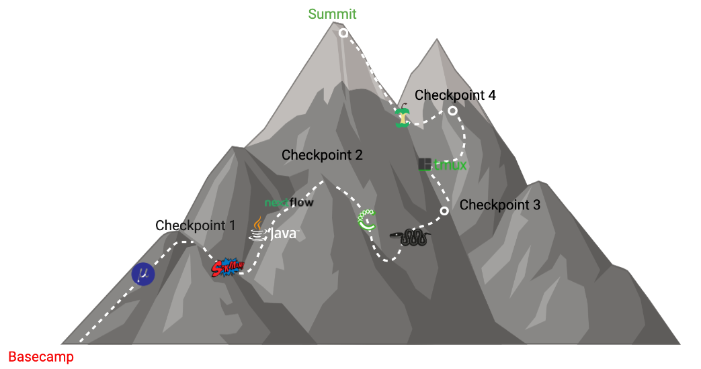

## Basecamp



### `PATH` and user-local `bin` folder

```console

mkdir $HOME/bin

export $PATH="$PATH:$HOME/bin"

```
### `micro`

A program used to edit plain text files, create and edit files based in various programming languages, handle “hand-coding” of many different languages.

What is micro? Terminal based [text editor](https://micro-editor.github.io/), no dependencies, easy to use and intuitive Smart and intuitive terminal orientated text editor, used for editing SSH files and other terminal tasks 

- https://github.com/zyedidia/micro
- https://micro-editor.github.io/

```console
curl https://getmic.ro | bash
```

- Built in help pages (Ctrl-E + help topic OR Ctrl-G), also help pages built into GitHub repository (https://github.com/zyedidia/micro)
- Able to be used in a modern terminal (MacOS, Windows, Linux, etc.)
- Similar keybindings/shortcuts compared to Microsoft word (save, copy, paste, undo)
- Similar to the text editor nano
- Install using prebuilt binary, quick-install script, eget, package managers (brew - Mac, snap – Linux, as well as many other package managers

To make the addition of `$HOME/bin` change permanent, let's update the `~/.bashrc` 

```console 
micro ~/.bashrc
```

```
export $PATH="$PATH:$HOME/bin"
```


References:
    - [StackExchange - Purpose of bin directory](https://unix.stackexchange.com/questions/237152/purpose-of-bin-directory#:~:text=Bin%20is%20an%20abbreviation%20of,aren't%20used%20to%20them)

## Checkpoint-1

### `sdkman`

https://sdkman.io/

"Software Development Kit Manager"  - a tool for managing parallel version of multiple Software Development Kits. 

We will use this essentially as a package manager for Java 

```console
curl -s "https://get.sdkman.io" | bash 
exec $SHELL
```

References
    - https://opensource.com/article/22/3/manage-java-versions-sdkman

### `java`

Programming language and computing platform, platform on which many services and applications are built 

```console 
sdk install java 17.0.6-amzn
```
References:
    - https://www.java.com/en/download/help/whatis_java.html

### `nextflow`

A workflow engine and language that enables scalable and reproducible scientific pipelines 

Allows for parallelisation and distribution computing – nextflow based on dataflow programming model, simplifies parallelisation

```
cd $HOME/bin

wget -qO- https://get.nextflow.io | bash

```
References:
    - https://github.com/nextflow-io/nextflow
    - [Story of Nextflow](https://elifesciences.org/labs/d193babe/the-story-of-nextflow-building-a-modern-pipeline-orchestrator)

## Checkpoint-2

### `conda` and `micromamba`

An open source _package management system_, and environment management system, able to install, run, and update packages and any dependencies, save and switch between environments, can package and distribute software from any language () 

Conda is an environment manager, switch between multiple environments with different dependencies, languages and softwares

Conda environments similar to virtual environments (pythons virtualenv), more powerful since mamba able to manage native dependencies and downloaded ones, able to generalise the virtual environment to many programmed languages


```console
wget https://repo.anaconda.com/miniconda/Miniconda3-py310_23.3.1-0-Linux-x86_64.sh

bash Miniconda3-latest-Linux-x86_64.sh -b -p $HOME/miniconda
```

`micromamba` is a minimal single-binary command line tool that is used to manage conda environments

```console
curl micro.mamba.pm/install.sh | bash
```

Cheatsheets: 
    - https://docs.conda.io/projects/conda/en/4.6.0/_downloads/52a95608c49671267e40c689e0bc00ca/conda-cheatsheet.pdf 
    - https://docs.conda.io/projects/conda/en/latest/_downloads/843d9e0198f2a193a3484886fa28163c/conda-cheatsheet.pdf

References
    - https://docs.conda.io/en/latest/
